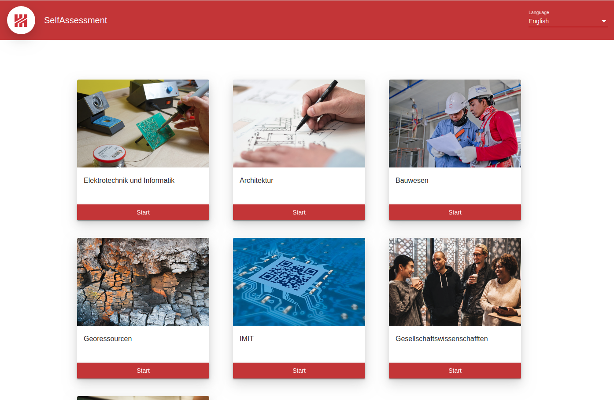
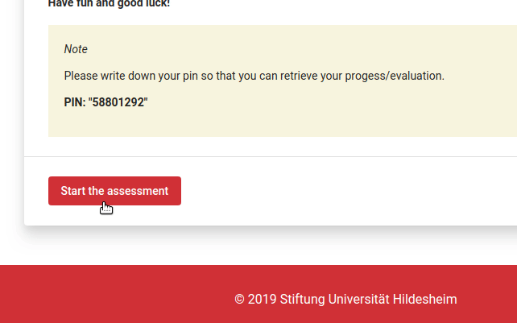
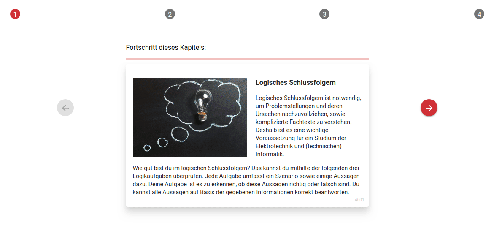
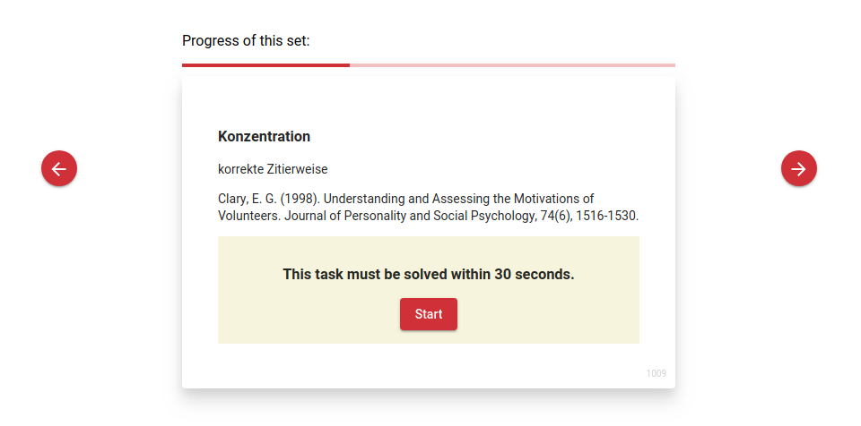
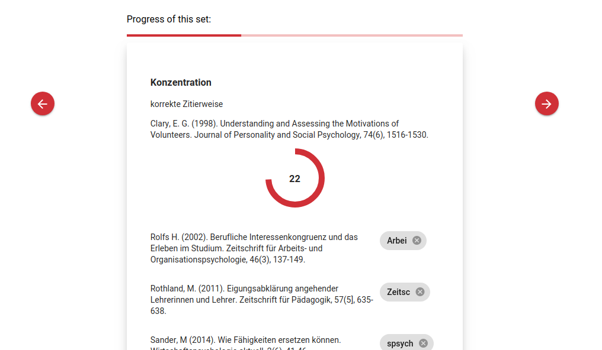
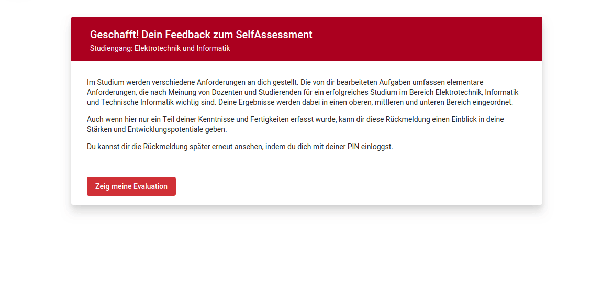

# Self Assessment

[](https://travis-ci.com/uni-hildesheim/SelfAssessment)

### Table of Contents
1. [About](#about)
2. [Getting started](#started)
3. [Project Structure](#structure)  
4. [Code Style](#style)  
5. [Contributor guide](#contributing)  
6. [Continuous Integration](#travis)  

<a name="about"></a>

## 1. About

This project is a self-assessment system which helps students to judge and evaluate their own skills in a particular field, so that they can make an informed decision about enrolling in a particular course.

Every course will cover questions related to the course-content so that aspiring students can get an idea of what to expect.

This program provides an expandable and customizable platform for such a purpose. 

*To learn more about the customization part read the 'Additional Documentation' Section*.

An admin can create a multitude of different courses for the user to choose from.

***



***

Internationalization is supported for the different courses and the overall static content.

Every user is assigned a pin which can be used to continue with the assessment at a later point in time or to retrieve the evaluation if the user has already finished the assessment.

***



***

It is possible to integrate infopages between the different tests and test-sets to inform the user about the specific task or the general topic.

The users progress is shown in two different ways. The progress inside the different sets and the progress across all sets.

It is also possible to jump between the sets or the continue the assessment even if the user does not answer any question.

***



***

There are currently 4 types of tests to learn more about them read the `Add Course` Section.

Every test can be converted into a speed-test, so that the user has only a limited amount of time to answer the questions.

***





***

At the end the user receives a detailed evaluation, including the total score and a complete feedback of every set. The user can retrace the progress and detect where a question was wrongly answered.

It is also possible to filter the entirety of questions by their respective type. 

***



***

<a name="started"></a>

## 2. Getting Started

### Deployment

* install [docker](https://www.docker.com)
* run multi-container application in project directory

```bash
docker-compose up
```

### Development

* install [mongodb](https://www.mongodb.com/) and run it

* run backend inside SelfAssessment/backend

```
npm install && node server.js
```

* run frontend inside SelfAssessment/SelfAssessment

```
npm install && ng serve
```

### Documentation

* install compodoc

```bash
npm install -g @compodoc/compodoc
```

* generate the documentation inside the project directory

```bash
npm run doc
```

* open the `index.html` file in the documentation directory

If you do not want to generate the full compodoc documentation, here are the links to the extra documentation:

* [Configuration](compodoc/config-doc/config.md)
  * [Language Support](compodoc/config-doc/language-support.md)
  * [Adding new Course](compodoc/config-doc/definition.md)
  * [Introducing new Category](compodoc/config-doc/category.md)

<a name="structure"></a>

## 3. Project Structure

* SelfAssessment: Angular frontend
* backend: Node.js backend
* .travis.yml: CI configuration, see [Continuous Integration](#travis)

Like any modern web application, this project is split into a frontend and a backend part. This means that deploying the project requires two servers to be running, one of them (the backend one) can be started using node.

<a name="style"></a>
## 4. Code Style
* SelfAssessment: see tslint.json
* backend: .eslintrc.json

As long as your code matches the linting rules defined in the specific subproject dirs, it should be acceptable for the project.

<a name="contributing"></a>
## 5. Contributor guide

### git commit messages
Commit messages headers should look like this:

```
component: Change summary

Here comes the additional commit message content.
The 'component' should be something like 'app' for frontend or 'server'
for backend.
The change summary starts with a capital letter and is a short and
concise description of the change.

As a general rule of thumb, we follow the classic 50/72 rule.
That means the first line of your commit (also referred to as summary
here) should not exceed 50 characters. Next up is exactly one line,
followed by an arbitrary number of additional lines describing the
commit, which must not exceed 72 characters each.
```

### code changes
Code changes are validated by our continuous integration process. More on that can be found in the [Continuous Integration](#travis) section. Right now, it performs automated javascript code linting, building and testing. If one of those validation processes fail, your code is highly unlikely to make it into the master (or any other) branch and should be revisited.

For further instructions and guidelines, please visit the component specific subdirectory and its README.md file.

<a name="travis"></a>
## 6. Continuous Integration
CI happens using the free and open source Travis CI service. Numerous branches are monitored and built, but the master branch is the most important one. The CI job will also be triggered for pull requests.

At the moment, the following steps are performed in order as part of the Travis build:

* lint (npm run lint)
* build (npm run build)
* test (npm run test)

If one of these 'stages' fail, subsequent ones are not executed.
