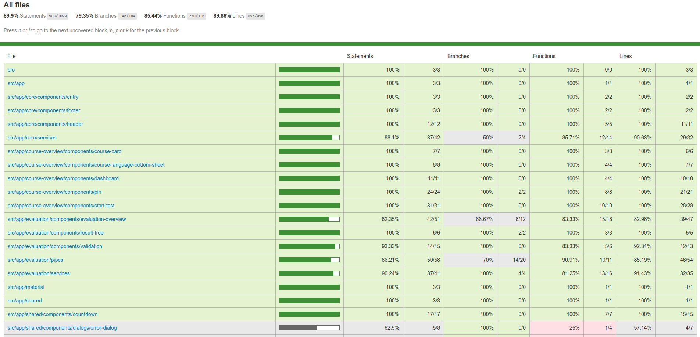

# Self Assessment frontend

<a name="models"></a>

## Models

The following UML diagram shows the composition of the frontend-models.

The diagram uses the typescript specific language design (`number`, `string`, `?` for optional parameters).

NOTE: It only depicts a fraction of the entire code, since the components, views, pipes etc. are not shown.

To learn more about those you can use the generated compodoc-documentation.


<a name="testing"></a>

## Testing

To run the tests for the frontend do the following inside `SelfAssessment/SelfAssessment`:

```bash
$ npm run test-headless
```

This runs all specs in the `ChromeHeadless` mode.

To generate a code-coverage report do the following:

```bash
$ npm run coverage
```

Open the index.html inside the generated converage directory to see the report:




### e2e Tests without config files ###

This project have e2e test without a dependence to a specific test config file. To run the tests for the frontend do the following inside `SelfAssessment/SelfAssessment:`

```bash
$ ng e2e
```

This runs all specs in the `chromeHeadless` mode.


To leave the  `chromeHeadless` mode and switch it to non headless mode, type the following code inside`SelfAssessment/e2e/protractor.config.js` at the line 12 and delete the old code:

```javascript
'browserName': 'chrome'
```


To switch back to `chromeHeadless` mode the following code must stand inside`SelfAssessment/e2e/protractor.config.js` at the lines 12 to 15:

```javascript
'browserName': 'chrome',
'chromeOptions':  {
   args; ["--headless"] 
}
```

The results after the tests have finished, should look like the following result on the bash:


###  


