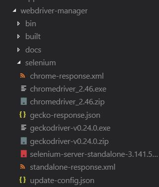
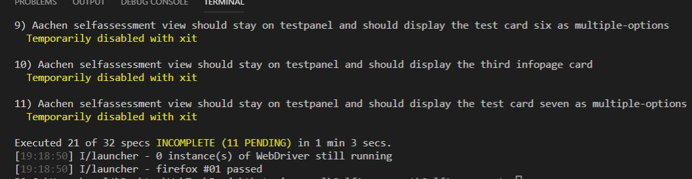

# Self Assessment frontend

<a name="models"></a>

## Models

The following UML diagram shows the composition of the frontend-models.

The diagram uses the typescript specific language design (`number`, `string`, `?` for optional parameters).

NOTE: It only depicts a fraction of the entire code, since the components, views, pipes etc. are not shown.

To learn more about those you can use the generated compodoc-documentation.


<a name="testing"></a>

## Testing

To run the tests for the frontend do the following inside `SelfAssessment/SelfAssessment`:

```bash
$ npm run test-headless
```

This runs all specs in the `ChromeHeadless` mode.

To generate a code-coverage report do the following:

```bash
$ npm run coverage
```

Open the index.html inside the generated converage directory to see the report:


### e2e Tests without config files ###

This project has two kinds of e2e tests: the ones that do not dependent on any config file and the ones that do.

To run the first kind of tests do the following inside `SelfAssessment/SelfAssessment:`

```bash
$ ng e2e
```

This runs all specs in the `chromeHeadless` mode.


To exit the  `chromeHeadless` mode and to switch to a non headless mode, replace the code inside`SelfAssessment/SelfAssessment/e2e/protractor.config.js` at the line 12 with the following statement:

```javascript
'browserName': 'chrome'
```

To switch back to `chromeHeadless` mode the following code has to be put inside `SelfAssessment/SelfAssessment/e2e/protractor.config.js` at the lines 12 to 15:

```javascript
'browserName': 'chrome',
'chromeOptions':  {
   args: ['--headless'] 
}
```

The output after running the tests, should look something like this:


### Specific e2e tests with the aachen course config

Notice: These tests require the Aachen config files in the project and the following two files:

`SelfAssessment/SelfAssessment/e2e/src/pages/assessment.po.ts`  and 

`SelfAssessment/SelfAssessment/e2e/src/assessment.e2e-spec.ts`

Before running these tests, please be sure that all five data files exist.


Due to an issue with Angular Material and the e2e Tests in `chromeHeadless` mode, these tests also require Firefox. Please make sure that Firefox version 53 or higher and Java are installed on your local computer. The following steps shows how to change the browser to Firefox:

1. Include the following lines into `SelfAssessment/SelfAssessment/e2e/protractor.config.js`,  starting at line 12:

   ```javascript
   'browserName': 'firefox',
    'moz:firefoxOptions': {
    	args: ['--headless']       
    } 
   ```

2. The webdriver needs an update to get the specific driver version for firefox, also run the following inside ``SelfAssessment/SelfAssessment/SelfAssessment/node_modules/protractor/bin` :

   ```bash
   $ webdriver-manager update
   ```

   

   Sources for the steps (Youtube Tutorial):

   - [Run Protractor e2e test on firefox](https://www.youtube.com/watch?v=AWZjMX2x4tI )

Once you finished the steps, the files in `SelfAssessment/SelfAssessment/SelfAssessment/node_modules/protractor/node_modules/webdriver-manager/selenium`  should have the same content as  the following:




To run the tests do the following  inside `SelfAssessment/SelfAssessment:`

```bash
$ ng e2e
```

This runs all specs in `firefoxHeadless` mode.

The results after the tests have finished, should look like:




While developing the e2e tests the following two issues occurred:

1. `chormeHeadless` + `Angular Material` -> Buttons can not be clicked.

   [mat-menu-item isn't clickable during e2e test](https://github.com/angular/material2/issues/10140 )

2. Error Module _debugger was not found.

   [Element explorer doesn't work on Node 8](https://github.com/angular/protractor/issues/4307 )

   

