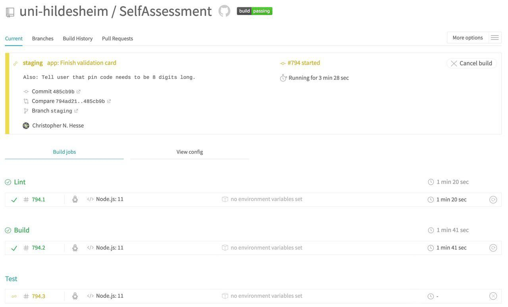

# Continuous integration

> One of the best ways to keep your project bug free is through a test suite, but it's easy to forget to run tests all the time. Continuous integration (CI) servers let you set up your project repository so that your tests run on every commit and pull request.
>
> [Angular Guide](<https://angular.io/guide/testing#set-up-continuous-integration>)

This application uses the free version of Travis CI, for open source projects, to implement continuous integration. Travis checks the specific commit as soon as it is pushed to the remote. 

### The following steps are performed in order as part of the Travis build:

- lint (npm run lint)
- build (npm run build)
- test (npm run test)

Travis checks every pushed commit on every branch. The left sidepanel shows the remaining commits that have not yet been tested and are still running.

